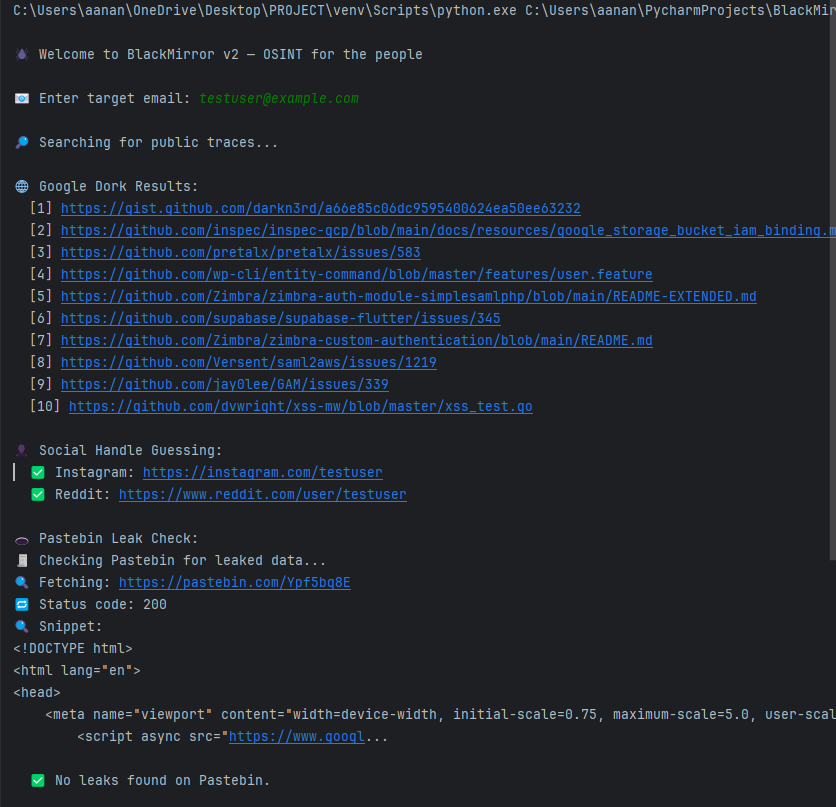
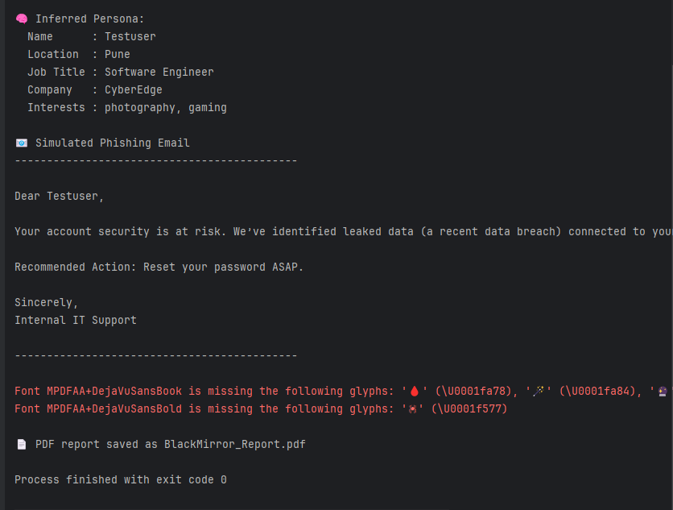
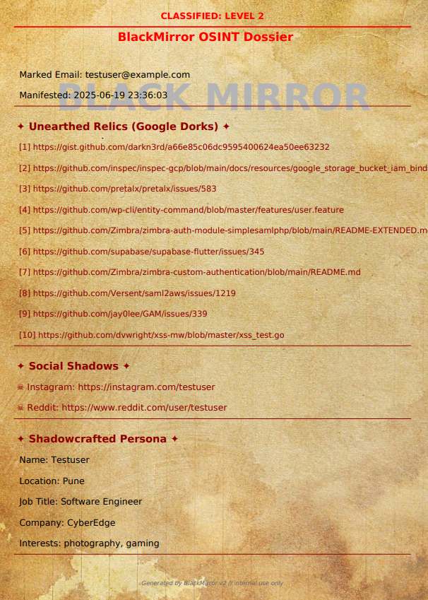
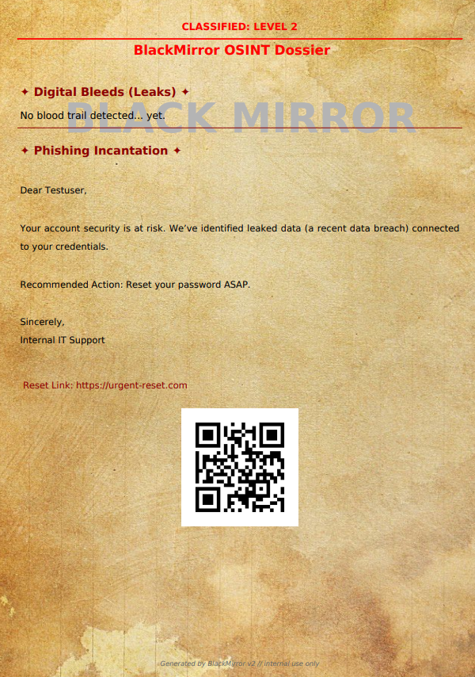

# 🕷️ BlackMirror v2 — OSINT for the People

BlackMirror v2 is an **ethical OSINT-based phishing simulator** designed to **demonstrate the real-world vulnerabilities of public information**. It collects publicly available data on a given email, constructs a psychological profile, and then generates a custom-tailored phishing email along with a haunting PDF dossier.

> 🧠 Think of it as your **cybersecurity crystal ball**, revealing what a malicious actor *could* do with just your email address.

---

## ⚙️ Features

- 🔎 **Google Dorking**: Extracts top search-engine indexed footprints.
- 👤 **Social Handle Guessing**: Attempts to guess common social profiles based on email patterns.
- 🧠 **Persona Generation**: Infers job title, company, location, and interests.
- 🕳️ **Pastebin Leak Check**: Scans for any leaked snippets or credential mentions.
- 🎯 **Phishing Email Generator**: Auto-creates a hyper-personalized phishing email.
- 📄 **PDF Report Generation**: Outputs an eerie, well-designed PDF report of findings with links, fake reset links, and a QR code.
- 🧙‍♀️ **Witchy Aesthetic**: Themed around dark OSINT magic, complete with a haunting PDF watermark and emoji-laced interface.

---

## 🖼️ Screenshots

### 🧠 CLI Output




### 📄 Generated PDF





---

## 🧪 What Makes BlackMirror Different?

🧤 While most phishing simulators are generic, BlackMirror focuses on **realistic psychological engineering** using **live OSINT techniques**.

| Feature                         | BlackMirror v2              | Traditional Simulators     |
|-------------------------------|-----------------------------|----------------------------|
| OSINT Collection              | ✅ Google dorking, Pastebin, social scraping | ❌ Usually static data |
| Personalized Phishing Email  | ✅ Tailored to job, interests, and leaks     | ❌ Generic language     |
| PDF Dossier Output           | ✅ Watermarked, themed, with QR & reset link | ❌ Basic or absent      |
| Ethical Usage Model          | ✅ Only uses publicly available mock data     | ❌ Often unclear         |
| Theme & Aesthetic            | ✅ Witchy, spooky, and stylized               | ❌ Plain & formal        |

BlackMirror is designed not just to simulate phishing attacks, but to **educate and terrify** in equal parts — ethically and creatively.

---

## 🚀 Getting Started

```bash
git clone https://github.com/your-username/blackmirror.git
cd blackmirror
pip install -r requirements.txt
python main.py
